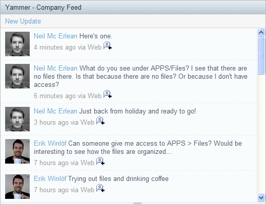
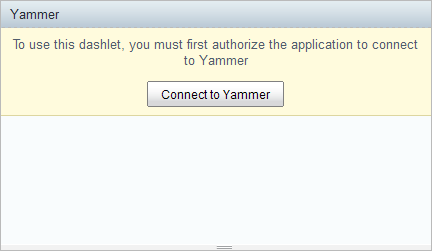
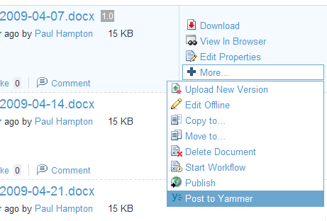

Yammer dashlet for Alfresco Share
======================================

Author: Will Abson

This project provides a custom dashlet to display messages from the Yammer social network and allows the user to reply to existing messages and compose new messages.

Since Yammer requires all communications to be authenticated, the dashlet provides an easy method for you to connect it to your Yammer account.

In addition a custom Document Library action can be used to post a link to the document directly to Yammer, if you have already connected using the dashlet.

**Note that the Yammer dashlet requires Alfresco 4.0 or greater, or a 3.4 installation with v1.0 Final Spring Surf libraries, and you must also install the [Share OAuth add-on](https://github.com/share-extras/share-oauth). The custom action will work with Alfreso 4.0 only**

Installation
------------

The dashlet is packaged as a single JAR file for easy installation into Alfresco Share.

To install the dashlet, simply drop the `yammer-dashlet-<version>.jar` file into the `tomcat/shared/lib` folder within your Alfresco installation, and restart the application server. You might need to create this folder if it does not already exist.

### Custom Action Installation (Optional)

The custom _Post to Yammer_ action is supported on Alfresco 4.0 and above. You can enable it on both the document details and document list pages by adding the following configuration to your `share-config-custom.xml`.

    <config evaluator="string-compare" condition="DocLibActions">
       <actionGroups>
          <actionGroup id="document-browse">
             <action index="999" id="document-yammer-post" />
          </actionGroup>
          <actionGroup id="document-details">
             <action index="999" id="document-yammer-post" />
          </actionGroup>
       </actionGroups>
    </config>

Building from Source
--------------------

An Ant build script is provided to build a JAR file containing the custom files, which can then be installed into the `tomcat/shared/lib` folder of your Alfresco installation.

To build the JAR file, run Ant from the base project directory.

    ant dist-jar

The command should build a JAR file named `yammer-dashlet-<version>.jar` in the `build/dist` directory within your project, which you can then copy into the `tomcat/shared/lib` folder of your Alfresco installation.

Alternatively, you can use the build script to _hot deploy_ the JAR file directly into a local Tomcat instance for testing. You will need to use the `hotcopy-tomcat-jar task` and set the `tomcat.home`
property in Ant.

    ant -Dtomcat.home=C:/Alfresco/tomcat hotcopy-tomcat-jar

After you have deployed the JAR file you will need to restart Tomcat to ensure it picks up the changes.

Usage
-----

  1. Log in to Alfresco Share and navigate to your user dashboard.
  2. Click the _Customize Dashboard_ button to edit the contents of the dashboard and drag the dashlet into one of the columns from the list of dashlets.
  3. If you have not previously connected the dashlet to your Yammer account then hit the _Connect to Yammer_ button to do this.

Known Issues
------------

### _The application Share Extras can not be authorized in your network. Please contact your network administrator. Application Share Extras_

As of Nov 11 it has not been possible to register Share Extras with Yammer as a global application, and it is currently limited to the _Yammer Developers_ and _Alfresco_ networks.

The workaround is to [register your own Yammer application](https://www.yammer.com/client_applications), which will give you a client token and secret that you can then use with your own network.

To configure these parameters, add the following to your `share-config-custom.xml`

    <config evaluator="string-compare" condition="Remote">
        <remote>
            <!-- Connector instance -->
            <connector>
                <id>yammer-oauth</id>
                <name>Yammer OAuth Connector</name>
                <description>HTTP Connector with support for OAuth authentication</description>
                <class>org.sharextras.webscripts.connector.HttpOAuthConnector</class>
                <consumer-key>mykey</consumer-key>
                <consumer-secret>mysecret</consumer-secret>
                <signature-method>PLAINTEXT</signature-method>
            </connector>
        </remote>
    </config>

where `mykey` is the client token and `mysecret` is the client secret for the application you registered.